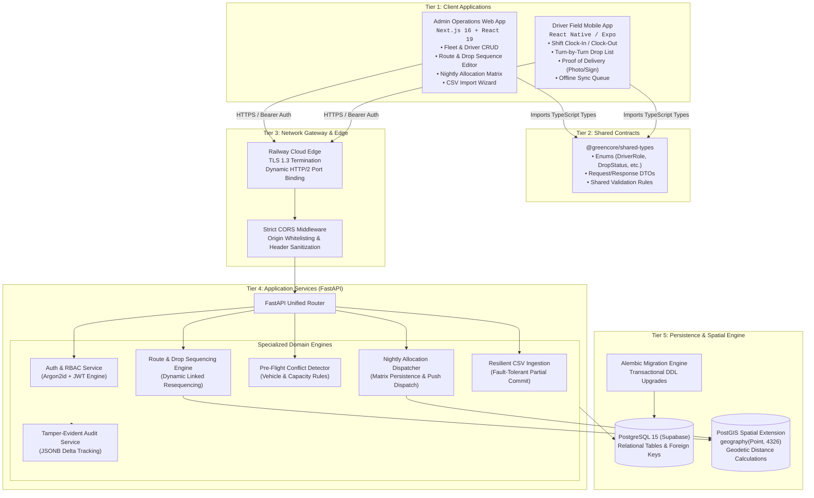
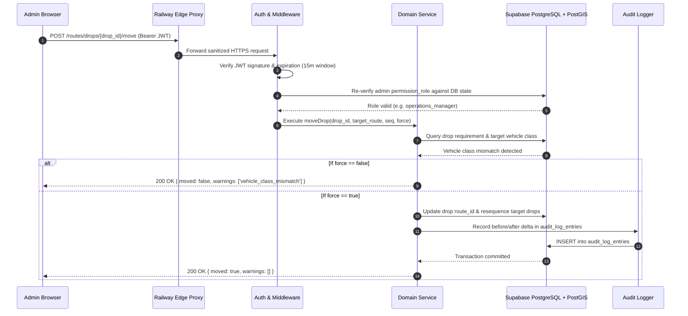

# 01 — System Architecture & Monorepo Topology

## 1. Executive Summary

Greencore is engineered as a decoupled, multi-tier system composed of independent client applications, a centralized domain contract package, and an asynchronous backend service backed by an enterprise spatial database. 

The architecture is designed to address a critical operational reality: **high-frequency field updates under intermittent network connectivity (drivers) combined with high-density operational dispatching (depot managers).**

---

## 2. Monorepo Structural Blueprint

The codebase is organized in a monorepo structure to facilitate continuous code sharing, atomic contract versioning, and unified testing:

```
Greencore/
├── .github/
│   └── workflows/
│       └── ci.yml                 # Automated Gitleaks secret scanning & Pytest CI pipeline
├── apps/
│   ├── admin/                     # Next.js 16 (App Router) Operations Web Dashboard
│   └── driver/                    # React Native Expo Mobile Application (Drivers)
├── packages/
│   └── shared-types/              # Domain enums, request/response DTOs, and API contracts
├── services/
│   └── api/                       # FastAPI 0.115 asynchronous backend service
│       ├── app/
│       │   ├── core/              # Config, DB engine, security middleware, dependencies
│       │   ├── models/            # SQLAlchemy ORM models (Driver, Route, Drop, Allocation, etc.)
│       │   ├── schemas/           # Pydantic schemas validating payloads
│       │   ├── routers/           # HTTP endpoints (auth, drivers, routes, allocations, meta)
│       │   └── services/          # Business logic, conflict engines, and audit services
│       ├── migrations/            # Alembic schema migration versions
│       ├── fixtures/              # Database seed fixtures (seed.json)
│       ├── tests/                 # Integration test suites (Pytest)
│       └── Dockerfile             # Multi-stage production container build
├── docs/                          # Product specifications, state tracking, and changelogs
├── documentations/                # Comprehensive architectural and engineering reference suite
└── railway.json                   # Production deployment orchestration configuration
```

---

## 3. High-Level Architectural Topology



---

## 4. Architectural Boundaries and Principles

### 4.1 Strict Domain Separation
- **Web App is for High-Density Operations:** The Admin Web App presents comprehensive data grids, bulk operations, conflict warnings, and audit inspection.
- **Mobile App is for Low-Friction Cab Use:** Drivers operate with one-thumb interactions, high contrast UI, minimal typing, and offline-first queueing.
- **Shared Types Prevent Schema Drift:** Both frontends consume `@greencore/shared-types`, ensuring that changes to schemas or status enums propagate across all client apps at compile time.

### 4.2 Network & Edge Security
All external communication to the API traverses Railway's edge proxy:
1. **Enforced TLS 1.3:** Plaintext HTTP is automatically redirected to HTTPS.
2. **Dynamic Container Port Adaptation:** The Docker runtime dynamically inspects `${PORT}` assigned by the orchestrator, binding Uvicorn seamlessly without hardcoding ports.
3. **CORS Isolation:** The API restricts browser access to verified administrator domains, preventing Cross-Origin Request Forgery (CSRF).

---

## 5. End-to-End Request/Response Lifecycle



---

## 6. Interview & Conference Talking Points

> **Why choose a Monorepo for Greencore?**  
> *"In logistics platforms, schema divergence between what dispatchers configure on the web and what drivers see on mobile leads to missed deliveries. By housing Next.js, React Native, and Shared Types in one monorepo, contracts are version-controlled atomically. When an enum or validation rule evolves, both clients are validated at compile-time before deployment."*

> **Why run FastAPI alongside Supabase PostgreSQL?**  
> *"While Supabase provides managed PostgreSQL and PostGIS, complex operational rules (like multi-drop sequence reordering, vehicle capacity conflict checking, and partial CSV ingestion) require expressive application-layer transactions. FastAPI delivers native async execution, automatic OpenAPI schema generation, and sub-millisecond response times."*
