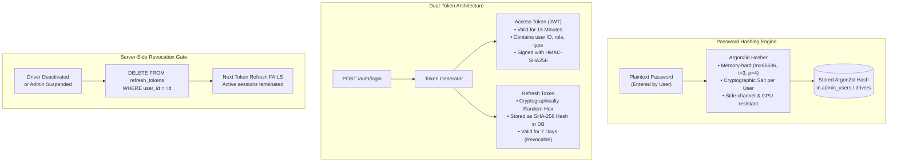
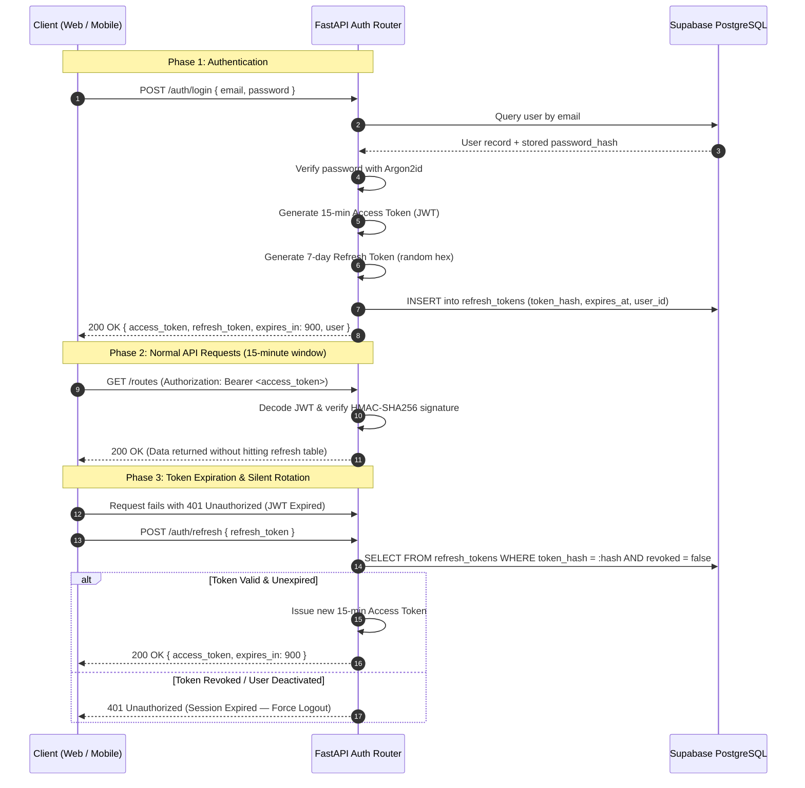
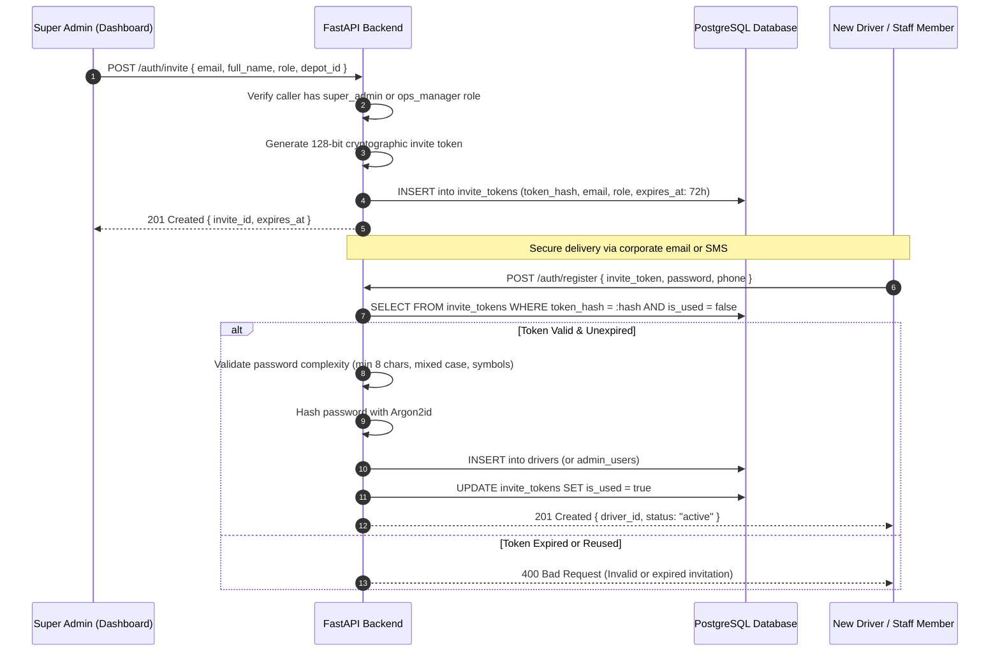

# 02 — Security, Cryptography & Access Control Architecture

## 1. Executive Summary

Enterprise logistics applications handle sensitive commercial intelligence: customer addresses, door access codes, high-value cargo routes, and real-time personnel GPS coordinates.

Greencore enforces a **zero-trust, invite-only security model** built on modern cryptographic standards. Public self-registration is eliminated by design. Authentication utilizes memory-hard **Argon2id** password hashing, short-lived **JSON Web Tokens (JWT)** with cryptographic rotation, and **server-side role re-verification** on every privileged request.

---

## 2. Core Cryptographic Architecture

---

## 3. The Dual-Token Lifecycle (Access vs. Refresh)

---

## 4. Role-Based Access Control (RBAC) Matrix

To prevent privilege escalation, all admin endpoints enforce **server-side role re-verification**. The role declared in a JWT is never trusted blindly; the endpoint middleware queries the live database record to ensure permissions have not been downgraded or revoked mid-session.

| Feature / Resource | `super_admin` | `operations_manager` | `route_manager` | `payroll_hr` | `read_only` | `driver` (Field) |
|---|:---:|:---:|:---:|:---:|:---:|:---:|
| **Manage Admin Users & Roles** | ✅ Full | ❌ Denied | ❌ Denied | ❌ Denied | ❌ Denied | ❌ Denied |
| **Driver Fleet Management (CRUD)** | ✅ Full | ✅ Full | ❌ Denied | 👁️ View only | 👁️ View only | ❌ Denied |
| **Driver Account Deactivation** | ✅ Full | ✅ Full | ❌ Denied | ❌ Denied | ❌ Denied | ❌ Denied |
| **Route & Drop Sequence Editing** | ✅ Full | ✅ Full | ✅ Full | ❌ Denied | 👁️ View only | ❌ Denied |
| **Route Conflict Override (`force`)** | ✅ Full | ✅ Full | ✅ Full | ❌ Denied | ❌ Denied | ❌ Denied |
| **Nightly Route Allocation Matrix** | ✅ Full | ✅ Full | ❌ Denied | ❌ Denied | 👁️ View only | ❌ Denied |
| **Confirm & Broadcast Notifications**| ✅ Full | ✅ Full | ❌ Denied | ❌ Denied | ❌ Denied | ❌ Denied |
| **CSV Route Card Import** | ✅ Full | ✅ Full | ✅ Full | ❌ Denied | ❌ Denied | ❌ Denied |
| **View Live GPS Location Map** | ✅ Full | ✅ Full | ✅ Full | ❌ **403 Forbidden** | ❌ Denied | ❌ Denied |
| **Driver Time Tracking & Timesheets** | ✅ Full | ✅ Full | ❌ Denied | ✅ Full | 👁️ View only | 👁️ Own only |
| **System Audit Log Inspection** | ✅ Full | 👁️ View only | ❌ Denied | 👁️ View only | 👁️ View only | ❌ Denied |

> **Privacy Hardening Note (Section 17.3):** Admins with the `payroll_hr` role are explicitly returned an HTTP 403 Forbidden on live location endpoints, rather than an empty map. An empty map is indistinguishable from "no active drivers" and conceals the privacy boundary from automated verification.

---

## 5. Invite-Only Onboarding & Credential Creation

In enterprise fleet operations, open public signups represent an unacceptable attack surface. Greencore implements **closed, invite-only onboarding** for both administrative staff and field drivers:

---

## 6. Immediate Session Revocation on Deactivation

When an employee departs or a contractor is suspended, simply setting `status = 'inactive'` in the database is insufficient if active JWT access tokens or refresh tokens remain circulating.

Greencore implements **atomic session termination**:
1. Admin triggers `POST /drivers/{id}/deactivate` with a mandatory reason.
2. The database updates `status = 'inactive'`.
3. In the exact same database transaction, all rows in `refresh_tokens` belonging to that user ID are deleted.
4. When the user's mobile app or browser attempts to refresh its 15-minute token, the server rejects the request with HTTP 401 Unauthorized, forcibly logging out the client immediately.
5. The action is permanently recorded in `audit_log_entries`.

---

## 7. Conference & Interview Talking Points

> **Why Argon2id over bcrypt or PBKDF2?**  
> *"Argon2id was the winner of the Password Hashing Competition (PHC). Unlike bcrypt, which is susceptible to FPGA and ASIC acceleration attacks due to low memory footprint, Argon2id is memory-hard. It requires configurable RAM allocations to compute, neutralizing GPU-accelerated dictionary attacks."*

> **How does Greencore balance offline field requirements with token revocation?**  
> *"We use short-lived 15-minute JWT access tokens paired with server-revocable 7-day refresh tokens. This ensures low-latency verification on active routes without hitting the database for every single drop update, while capping the rogue token window at 15 minutes if a driver's credentials are revoked."*
