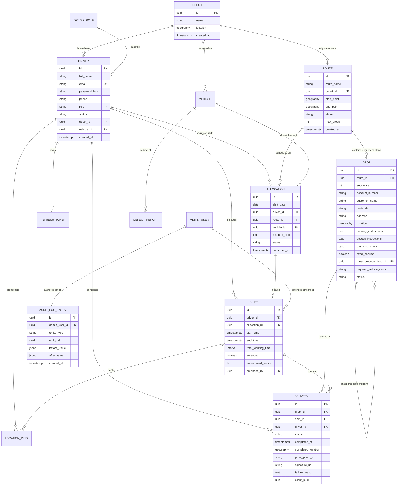
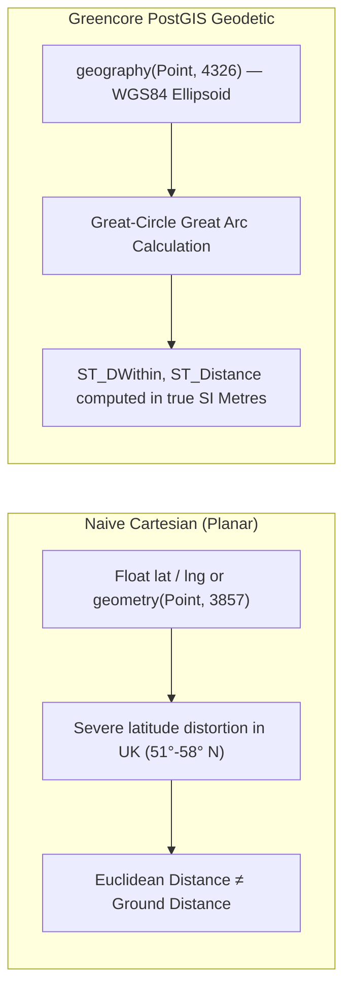

# 03 — Database Schema & PostGIS Spatial Data Modeling

## 1. Executive Summary

Greencore's persistence layer is built on **PostgreSQL 15** with the **PostGIS** geospatial engine, hosted on Supabase and migrated through **Alembic**.

Unlike simplistic delivery apps that store coordinates as generic floating-point latitude and longitude pairs, Greencore uses true `geography(Point, 4326)` spatial types. This guarantees that spatial queries (such as nearest drop lookups, depot proximity, and geofencing) account for the earth's oblate spheroidal curvature rather than planar Cartesian approximations.

---

## 2. Complete Entity-Relationship Diagram (ERD)



---

## 3. Spatial Modeling with PostGIS: `geography` vs. `geometry`



### 3.1 PostGIS Distance Query Example
When finding all drops within a 5-kilometer radius of a depot or driver:

```sql
-- Computes real ground meters across the WGS84 earth spheroid
SELECT 
    id, 
    customer_name, 
    postcode,
    ST_Distance(location, ST_MakePoint(-0.1278, 51.5074)::geography) AS distance_meters
FROM drops
WHERE ST_DWithin(location, ST_MakePoint(-0.1278, 51.5074)::geography, 5000)
ORDER BY distance_meters ASC;
```

---

## 4. Key Relational Constraints & Business Rules

1. **Drop Resequencing Integrity (`ix_drops_route_id_sequence`):**
   - Drops within a route are indexed on `(route_id, sequence)`.
   - The sequence numbering is continuous (1, 2, 3... N). The engine automatically shifts sequence indices up or down during inserts, deletions, or transfers.
2. **Route Capacity Constraints (`ROUTE.max_drops`):**
   - Configurable per route (e.g. 35 drops max for London Central).
   - Validated pre-flight by the conflict engine before any drop move is executed.
3. **Vehicle Class Compatibility (`DROP.required_vehicle_class`):**
   - If a delivery requires a Class 1 HGV (e.g., industrial pallet loading dock) and an admin transfers it to a Van route, the conflict engine throws a `vehicle_class_mismatch` warning.
4. **Offline Deduplication (`DELIVERY.client_uuid`):**
   - When drivers complete drops offline in remote basements, the mobile app generates a cryptographic UUIDv4 on-device.
   - When reconnected, the background sync worker uses `client_uuid` to ensure idempotent commits, preventing duplicate proof-of-delivery records.
5. **Tamper-Evident Audit Trail (`AUDIT_LOG_ENTRY`):**
   - Stores granular JSONB deltas (`before_value` and `after_value`) recording only modified fields.
   - Audit entries are strictly append-only; even `super_admin` users cannot update or delete rows.

---

## 5. Schema Migration & Boot Orchestration (Alembic)

Database schema evolution is managed via Alembic in `services/api/migrations/`:

```bash
# Executed automatically on every Railway container start:
alembic upgrade head && uvicorn app.main:app --host 0.0.0.0 --port ${PORT}
```

Because migrations execute before Uvicorn starts, any newly deployed API code is guaranteed to boot against a database schema that is fully up to date.

---

## 6. Interview & Conference Talking Points

> **Why choose PostGIS `geography` over standard `geometry`?**  
> *"In the UK, latitude ranges from 50° to 60° North. A planar coordinate projection assumes 1 degree of longitude is the same length as 1 degree of latitude, which introduces massive distance errors (over 40%). PostGIS `geography(Point, 4326)` calculates great-circle distances along the true WGS84 earth ellipsoid in SI meters, ensuring geofencing and delivery proximity checks are pinpoint accurate."*

> **How does Greencore handle offline delivery conflicts?**  
> *"Every delivery event generates an idempotent `client_uuid` on the mobile device. Even if an unstable 4G connection retries the sync payload three times, the database recognizes the unique client UUID and applies an atomic UPSERT without duplicating delivery records or double-notifying dispatch."*
