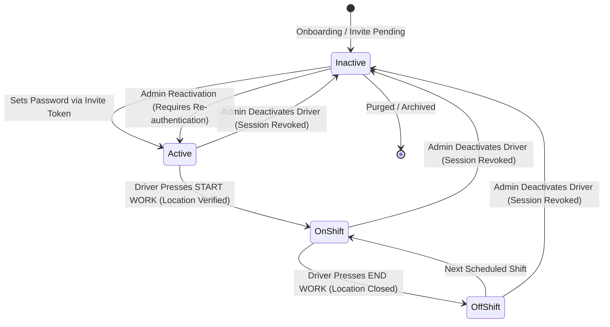
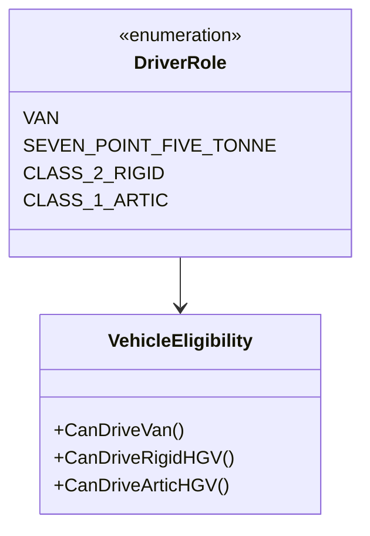
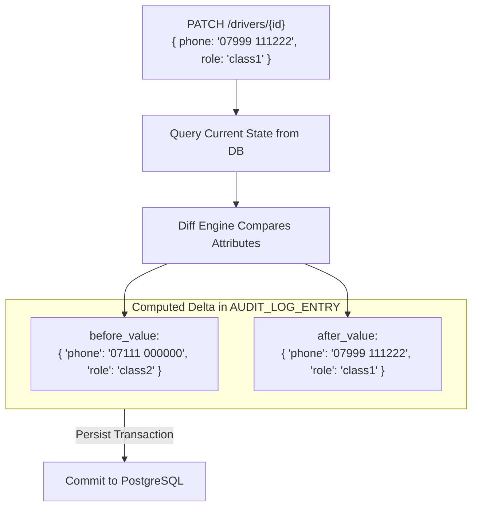
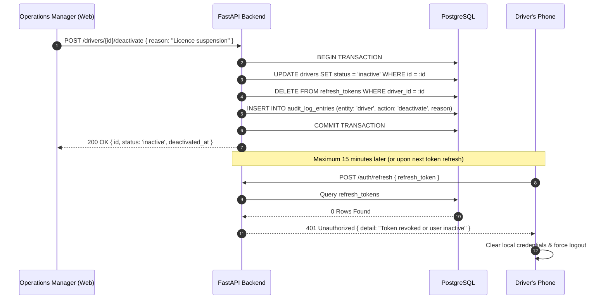

# 04 — Driver Fleet Management Lifecycle & Governance

## 1. Executive Summary

Transport drivers represent the operational frontline of Greencore. Managing driver accounts requires strict adherence to legal compliance (licence verification, vehicle class entitlement), operational oversight (active shift states), and employment security.

The Driver Management sector (`/drivers`) implements end-to-end lifecycle governance: vehicle role classification, field-level audit delta tracking, and instant cryptographic token revocation upon deactivation.

---

## 2. Driver State Lifecycle



---

## 3. Vehicle Classification Hierarchy

Drivers are qualified against specific commercial vehicle categories. This qualification dictates what delivery routes can be legally and safely allocated:



| Role Code | Description | Typical Vehicle | Operational Weight Limit | Driver Qualification |
|---|---|---|---|---|
| `van` | Standard commercial courier van | Mercedes Sprinter, Ford Transit | Up to 3.5 Tonnes | Standard UK Category B |
| `7_5t` | Medium goods vehicle (rigid) | DAF LF 7.5t | 3.5t – 7.5 Tonnes | UK Category C1 |
| `class2` | Large rigid goods vehicle | 18t / 26t Rigid HGV | Up to 26 Tonnes | UK Category C (Class 2) |
| `class1` | Articulated heavy goods vehicle | Tractor unit + Semi-trailer | Up to 44 Tonnes | UK Category C+E (Class 1) |

---

## 4. Fine-Grained Audit Diffs on Profile Modification

Per Section 14.2 & 17.4, whenever an administrator edits a driver profile (e.g. changing phone number, licence number, or vehicle class), Greencore **never records the entire row**. It computes an exact attribute-level delta:



### 4.1 Implementation Code in `services/api/app/services/driver.py`:
```python
# Detect exact changed fields only
changes = {}
before_vals = {}
after_vals = {}

for field, new_val in update_data.items():
    old_val = getattr(driver, field)
    if old_val != new_val:
        changes[field] = (old_val, new_val)
        before_vals[field] = str(old_val) if old_val is not None else None
        after_vals[field] = str(new_val) if new_val is not None else None

if admin_user and changes:
    record_audit_event(
        db,
        admin_user_id=admin_user.id,
        entity_type="driver",
        entity_id=driver.id,
        before=before_vals,
        after=after_vals,
    )
```

---

## 5. Deactivation & Token Revocation Sequence

When a driver resigns, is terminated, or suspended due to licence endorsement:



---

## 6. Interview & Conference Talking Points

> **Why compute fine-grained JSONB diffs for audit logs instead of snapshotting rows?**  
> *"Snapshotting entire database rows causes database bloat and makes compliance investigations difficult. By storing only the before/after deltas for modified attributes in Postgres JSONB, queries like 'Who changed John's vehicle qualification from Class 2 to Class 1 on June 12th?' can be resolved instantly with an indexed JSONB query."*

> **How does Greencore handle driver deactivations safely?**  
> *"In field logistics, an inactive driver retaining app access could view sensitive customer delivery instructions or access codes. Greencore combines status flag toggling with atomic deletion of all active refresh tokens in a single transaction, cutting off API access within minutes."*
