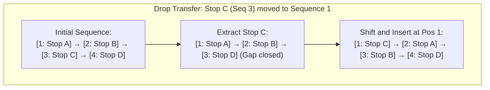
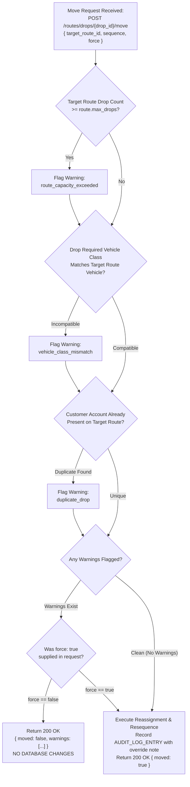
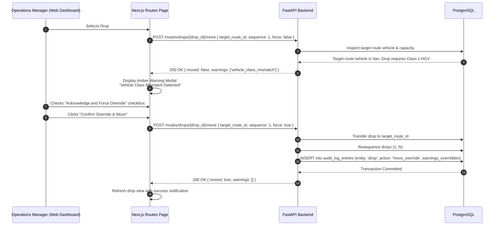

# 05 — Route & Drop Sequencing Engine & Conflict Verification

## 1. Executive Summary

In commercial distribution, a route is not merely an unordered bag of stops; it is a **strictly ordered sequence** of deliveries subject to physical truck constraints, customer delivery time windows, and loading bay physical access limits.

Greencore's Route & Drop Engine manages:
1. **Dynamic Linked Sequence Numbering:** Adding, removing, or shifting stops automatically recalculates contiguous sequence integers (1..N).
2. **Pre-Flight Conflict Verification Engine:** Intercepts route transfer operations to detect vehicle class incompatibilities and route capacity overflows before changes are persisted.
3. **Audited Force Override (Section 17.4):** Allows dispatch managers to override warnings when emergency field operational decisions supersede static constraints.

---

## 2. Dynamic Sequence Renumbering Mechanics

When a drop is moved from sequence position $i$ to position $j$, all intermediate stops must shift predictably without leaving gaps or creating duplicate sequence numbers:



### 2.1 Resequencing Logic in `services/api/app/services/route.py`:
```python
def resequence_route(db: Session, route_id: uuid.UUID) -> None:
    """Ensures drop sequence numbers are strictly 1..N with zero gaps."""
    drops = (
        db.query(Drop)
        .filter(Drop.route_id == route_id)
        .order_by(Drop.sequence.asc(), Drop.id.asc())
        .all()
    )
    for idx, drop in enumerate(drops, start=1):
        if drop.sequence != idx:
            drop.sequence = idx
    db.flush()
```

---

## 3. Pre-Flight Conflict Detection Engine

Before any drop transfer (`POST /routes/drops/{id}/move`) is saved to the database, it passes through the **Pre-Flight Conflict Detection Pipeline**:



---

## 4. Conflict Rules Specification (Section 15.7)

### 4.1 `vehicle_class_mismatch`
- **Condition:** Drop specifies `required_vehicle_class = 'class1_hgv'` (e.g. standard loading bay height or 26-pallet order), but target route is assigned a `van` or `7_5t` vehicle.
- **Risk Avoided:** Dispatching a small van to collect pallets it cannot physically hold or access.

### 4.2 `route_capacity_exceeded`
- **Condition:** Target route has `max_drops = 30`, and currently holds 30 drops. Transferring an additional stop would raise the total to 31.
- **Risk Avoided:** Driver exceeding legal EU Drivers' Hours working time limits (Regulation EC 561/2006).

### 4.3 `duplicate_drop`
- **Condition:** Target route already contains a drop for the exact same customer account number on that delivery day.
- **Risk Avoided:** Multiple drivers showing up at the same customer back-to-back.

---

## 5. End-to-End Conflict Flow Sequence



---

## 6. Interview & Conference Talking Points

> **Why return HTTP 200 with `{ moved: false, warnings: [...] }` instead of HTTP 400 Bad Request on conflict?**  
> *"In REST design, a 4xx error indicates a malformed or illegal client request. In field logistics dispatch, a conflict warning is not an error — it is business domain feedback. The request was syntactically perfect, but the business engine flagged an operational hazard. Returning 200 with structured warning codes allows the frontend to render an informative modal allowing human supervisors to review and force-override with an audit trail."*

> **How does Greencore guarantee continuous drop sequences without race conditions?**  
> *"Drop resequencing runs inside an atomic PostgreSQL database transaction with `FOR UPDATE` row-level locks on the route. If two dispatchers attempt to move drops within the same route simultaneously, the transactions serialize, guaranteeing continuous sequence numbering without duplicate positions."*
