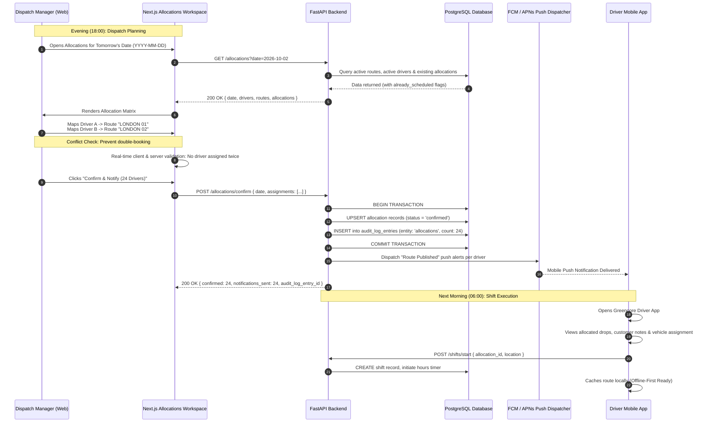
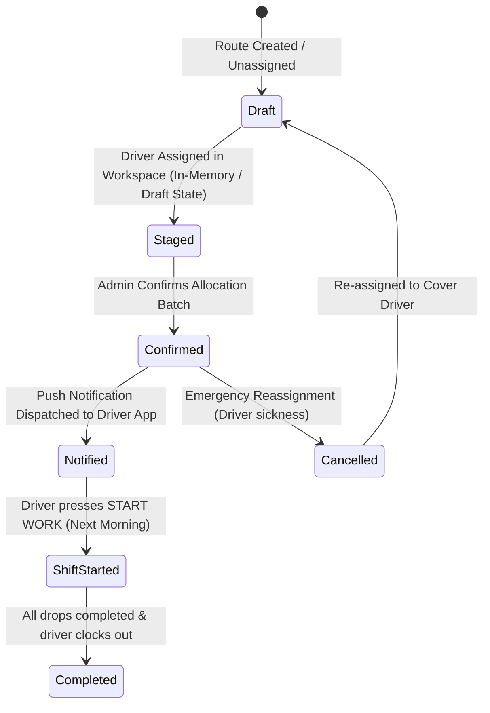

# 06 — Nightly Route Allocations & Dispatch Workflow

## 1. Executive Summary

In commercial depot operations, the bridge between static route plans and real-world execution is the **Nightly Allocation Workflow**. 

Every evening (typically between 16:00 and 20:00), dispatch managers review tomorrow's delivery requirements, evaluate driver availability, resolve scheduling conflicts, and publish assignments. Once confirmed, automated push notifications are dispatched to mobile devices so drivers wake up with their pre-loaded manifest ready for departure.

---

## 2. End-to-End Nightly Allocation Lifecycle



---

## 3. Allocation Entity State Transitions



---

## 4. API Contract & Implementation Details (Section 14.4)

### 4.1 Overview Query (`GET /allocations?date=YYYY-MM-DD`)
Returns a unified view of the depot for that specific date:
```json
{
  "date": "2026-10-02",
  "drivers": [
    {
      "id": "b7e10000-0000-0000-0000-000000000001",
      "full_name": "Test Driver One",
      "role": "class1",
      "already_scheduled": false,
      "vehicle_id": "c0000000-0000-0000-0000-000000000001"
    }
  ],
  "routes": [
    {
      "id": "e0000000-0000-0000-0000-000000000001",
      "route_name": "LONDON NORTH 01",
      "drop_count": 28,
      "allocated": false
    }
  ],
  "allocations": []
}
```

### 4.2 Confirmation Batch (`POST /allocations/confirm`)
Submits confirmed assignments and triggers notification fan-out:
```json
// Request
{
  "date": "2026-10-02",
  "assignments": [
    {
      "driver_id": "b7e10000-0000-0000-0000-000000000001",
      "route_id": "e0000000-0000-0000-0000-000000000001"
    }
  ]
}

// Response
{
  "confirmed": 1,
  "notifications_sent": 1,
  "audit_log_entry_id": "99b0c793-948f-4cf4-a828-5776269df6f1"
}
```

---

## 5. Resilience & Edge Cases

1. **Driver Double-Booking Prevention:**
   The workspace UI and backend API both inspect candidate assignments to ensure no driver ID appears more than once for a given calendar date.
2. **Offline Mobile Caching:**
   When the driver opens the app in the morning, the confirmed allocation downloads the complete route manifest into local SQLite storage. If the vehicle drives into a mobile dead zone at 07:00, the driver still has complete access to addresses, access codes, and sequences.

---

## 6. Interview & Conference Talking Points

> **How does the nightly allocation model avoid morning dispatcher chaos?**  
> *"Traditional depots rely on paper route cards printed at 05:00 AM, creating a bottleneck of 40 drivers in a small dispatch office. Greencore shifts this entirely to an evening digital allocation workflow. Routes are assigned the night before and pushed directly to driver phones. When drivers arrive at the yard at 06:00, they simply perform vehicle checks, tap 'Start Work' in the cab, and roll out immediately."*

> **How is accountability maintained when emergency re-assignments happen?**  
> *"If an allocated driver calls in sick at 05:30 AM, the operations manager reassigns the route in the web dashboard. The API cancels the previous allocation, links the cover driver, emits a priority notification, and writes an immutable entry into `audit_log_entries` capturing the time and reason for the swap."*
