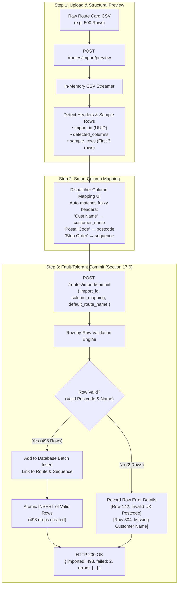
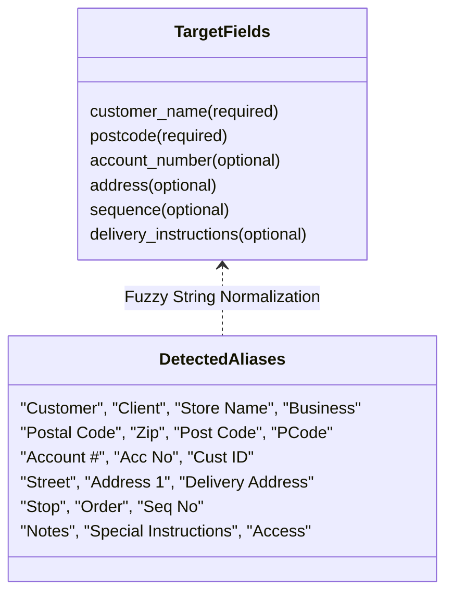

# 07 — Resilient CSV Ingestion Pipeline & Fault Tolerance

## 1. Executive Summary

Legacy transport logistics systems frequently export customer delivery cards as unstandardized CSV or Excel spreadsheets filled with human typos, missing postcodes, or malformed strings.

In traditional software, a single bad row causes the entire file upload to abort with a generic error (e.g. `Error on line 147: null pointer`), forcing dispatchers into a frustrating cycle of manual spreadsheet editing. 

Greencore solves this with an **intelligent 3-step import wizard** and an **acceptance-tested partial-success commit pipeline (Section 17.6)**: valid drops are committed immediately, while invalid rows are isolated and reported with line numbers and specific corrective reasons.

---

## 2. Ingestion Pipeline Architecture



---

## 3. The Section 17.6 Acceptance Standard

The Greencore Technical Specification sets a non-negotiable benchmark in Section 17.6:

> **Acceptance Criterion 17.6:**  
> *"Given an uploaded route file with 342 rows where 2 rows have invalid postcodes, when the import is committed, then 340 rows import successfully and 2 are reported individually with row number and reason — the entire import never fails because of a subset of bad rows."*

### 3.1 Implementation in `services/api/app/services/route.py`:
```python
imported_count = 0
failed_count = 0
errors = []

for row_idx, row in enumerate(raw_rows, start=1):
    try:
        customer_name = row.get(mapping.get("customer_name", ""))
        postcode = row.get(mapping.get("postcode", ""))
        
        if not customer_name or not customer_name.strip():
            raise ValueError("Customer name is required but empty")
        
        if not postcode or len(postcode.strip()) < 3:
            raise ValueError(f"Invalid postcode value '{postcode}'")

        # Create drop linked to target route
        create_drop_record(db, route_id=target_route.id, data=row)
        imported_count += 1

    except Exception as e:
        failed_count += 1
        errors.append({
            "row": row_idx,
            "reason": str(e)
        })

db.commit()

return {
    "imported": imported_count,
    "failed": failed_count,
    "errors": errors
}
```

---

## 4. Column Mapping Flexibility

Different customer ERPs output varying column headers. Greencore's fuzzy-matching normalizer automatically binds common variations:



---

## 5. Itemized Failure Reporting in the Admin UI

When an import completes with partial success, the dispatcher receives a clear diagnostic breakdown:

```json
{
  "imported": 340,
  "failed": 2,
  "errors": [
    {
      "row": 47,
      "reason": "Invalid postcode value 'ZZ99 9ZZ'"
    },
    {
      "row": 192,
      "reason": "Customer name is required but was blank"
    }
  ]
}
```

The user interface renders:
- **Green Success Card:** `340 Drops Successfully Imported into Route Portfolio`
- **Amber Warning Table:** Itemizes `Row 47` and `Row 192` with the exact validation message so the dispatcher can manually add those two drops or adjust their spreadsheet without re-importing the 340 valid rows.

---

## 6. Interview & Conference Talking Points

> **Why design an import pipeline for partial success rather than strict all-or-nothing transactions?**  
> *"In consumer APIs, all-or-nothing atomic rollbacks make sense. But in real-world supply chain operations, trucks are rolling in 90 minutes. If an import of 400 delivery stops crashes because one row has a missing postal code, rolling back all 400 stops paralyzes depot departure. Greencore imports the 399 valid drops immediately so route planning can proceed, and isolates the 1 failed stop for immediate correction."*

> **How does the parser prevent memory exhaustion with large multi-megabyte CSV files?**  
> *"The backend uses streaming generators rather than buffering entire files into memory. It reads rows sequentially, streams validation in bounded memory chunks, and executes bulk database inserts in batches of 500 rows, ensuring predictable RAM usage even on budget cloud container instances."*
