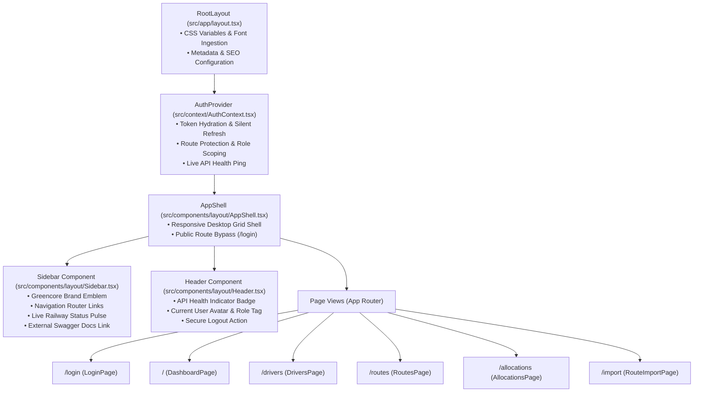
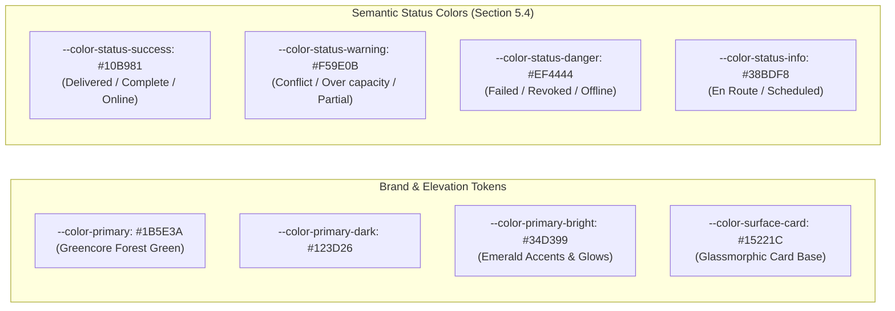
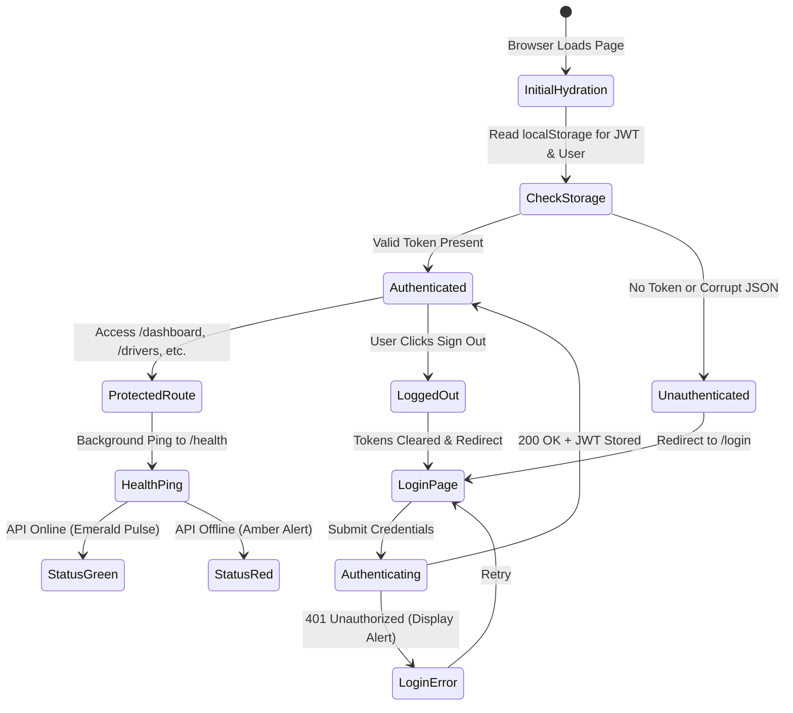

# 08 — Admin Dashboard Frontend Engineering

## 1. Executive Summary

The Greencore Admin Dashboard (`apps/admin`) is a high-density, mission-critical operations web application built with **Next.js 16 (App Router)**, **React 19**, and **TypeScript**.

Guided by the foundational design principle from Section 5.1 of the Technical Specification:
> *"Admin is dense, driver is sparse. The admin dashboard is a data-management tool — normal desktop information density is fine there. The driver app is not."*

The interface adopts a sleek **dark operations control center aesthetic** (deep slate with emerald accents), ensuring maximum readability during prolonged night shifts in depot dispatch rooms while reducing eye strain.

---

## 2. Component Hierarchy & Layout Structure



---

## 3. Design System & Token Hierarchy (Section 18)

Styles are defined natively in [`src/app/globals.css`](file:///c:/Users/Jo$h/Desktop/Visual%20Studio%20Code/Greencore/apps/admin/src/app/globals.css) using CSS Custom Properties conforming to Section 18 design tokens:



---

## 4. Frontend State & Authentication Flow



---

## 5. Type-Safe Client Layer (`@greencore/shared-types`)

The Admin Dashboard eliminates runtime type mismatches by compiling directly against [`packages/shared-types`](file:///c:/Users/Jo$h/Desktop/Visual%20Studio%20Code/Greencore/packages/shared-types):

```typescript
// apps/admin/src/lib/api.ts
import type {
  Driver,
  DriverCreateRequest,
  RouteSummary,
  RouteDetail,
  DropMoveResponse,
  AllocationOverviewResponse,
  AllocationConfirmResponse,
} from "@greencore/shared-types";

// Every API method returns strictly typed promises
export const api = {
  drivers: {
    list: (params?: { page?: number; role?: string }) => 
      request<DriverListResponse>("/drivers"),
    create: (data: DriverCreateRequest) => 
      request<Driver>("/drivers", { method: "POST", body: JSON.stringify(data) }),
  },
  routes: {
    moveDrop: (dropId: string, data: DropMoveRequest) =>
      request<DropMoveResponse>(`/routes/drops/${dropId}/move`, {
        method: "POST",
        body: JSON.stringify(data),
      }),
  },
  allocations: {
    confirm: (data: AllocationConfirmRequest) =>
      request<AllocationConfirmResponse>("/allocations/confirm", {
        method: "POST",
        body: JSON.stringify(data),
      }),
  },
};
```

---

## 6. Page-by-Page Feature Specifications

### 6.1 Dispatch Overview (`/`)
- Real-time KPI statistics: Registered Drivers, Active Routes, Total Drops across network, and Allocation Readiness for tomorrow's shifts.
- Live Railway cluster health indicator with round-trip latency checks.
- High-priority quick actions: Daily Allocations, Driver Roster, CSV Import.

### 6.2 Driver Fleet Roster (`/drivers`)
- Search filter by name, email, or licence number.
- Role filters by vehicle entitlement (`van`, `7_5t`, `class1`, `class2`).
- Driver creation modal with instant credential setup.
- Profile update modal with audit delta tracking.
- Driver deactivation modal requiring operational rationale and triggering instant token revocation.

### 6.3 Routes & Drop Sequencer (`/routes`)
- Dual-pane layout: Route selector on the left, sequenced stops table on the right.
- Displays drop sequence badges, customer names, accounts, postcodes, and vehicle class requirements.
- Drop transfer modal with pre-flight conflict warnings and audited force-override toggling.

### 6.4 Nightly Allocations Workspace (`/allocations`)
- Calendar date picker defaulting to tomorrow with quick-toggle buttons (`Today`, `Tomorrow`, `+2 Days`).
- Interactive route-driver assignment grid.
- Real-time client-side detection of duplicate driver assignments.
- Confirmation modal summarizing changes, publishing assignments, and sending mobile push notifications.

### 6.5 Route CSV Ingestion Wizard (`/import`)
- Drag-and-drop CSV uploader with client-side file inspection.
- Column mapping interface with automatic fuzzy-matching of headers.
- Partial-success commit reporting itemized row-by-row failure reasons per Section 17.6.

---

## 7. Interview & Conference Talking Points

> **Why Next.js App Router for an internal operations dashboard?**  
> *"Next.js App Router provides optimal layout persistence. The sidebar navigation, top header, and WebSocket connection states persist across route navigations without re-rendering the layout shell. Furthermore, React Server Components provide zero-bundle-size rendering for heavy static sections, while client components handle high-frequency interactions like allocation matrix selects and drop transfers."*

> **How does the frontend handle token security?**  
> *"Access tokens are held in client memory and local storage, but their attack surface is minimized by a strict 15-minute expiration policy. If an access token were intercepted, it would expire before an attacker could exploit it, while the long-lived refresh token remains revocable server-side at any moment."*
