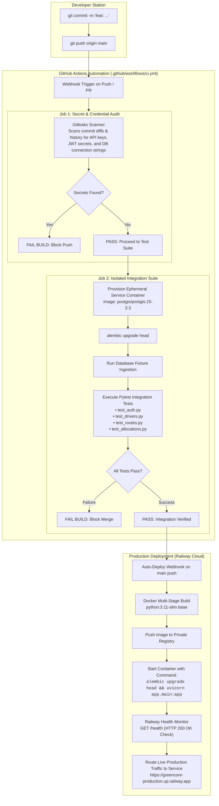
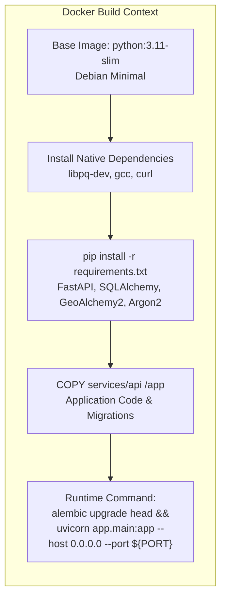

# 09 — DevOps, Containerization & CI/CD Pipeline

## 1. Executive Summary

In enterprise logistics platforms, downtime during dispatch hours can halt hundreds of vehicles. 

Greencore implements a hardened, cloud-native DevOps lifecycle:
1. **Multi-Stage Containerization:** A slim production Docker image optimized for rapid build times and minimal attack surface.
2. **Zero-Downtime Auto-Migrations:** Automated Alembic transactional DDL migrations executed on container boot prior to web server initialization.
3. **Automated Secret Scanning (Gitleaks):** Pre-commit and CI-enforced scanning to prevent credential leakage.
4. **Isolated Ephemeral CI Testing:** Every pull request and push to `main` spins up an ephemeral PostgreSQL + PostGIS container in GitHub Actions and runs the full test suite before code can be merged or deployed.

---

## 2. CI/CD Pipeline Flowchart



---

## 3. Production Multi-Stage Dockerfile Architecture

The production Dockerfile in `services/api/Dockerfile` utilizes a clean, single-responsibility layout built on `python:3.11-slim`:



### 3.1 Dynamic Port Adaptation
Because cloud container platforms (such as Railway or Render) assign dynamic port numbers via the `$PORT` environment variable, the Docker entrypoint utilizes dynamic shell expansion:

```dockerfile
CMD sh -c "alembic upgrade head && uvicorn app.main:app --host 0.0.0.0 --port ${PORT:-8080}"
```
- If `$PORT` is set by Railway (e.g. `8080`), Uvicorn binds directly to it.
- If run locally without `$PORT`, it defaults safely to port `8080`.

---

## 4. GitHub Actions Configuration (`.github/workflows/ci.yml`)

```yaml
name: Greencore CI

on:
  push:
    branches: [main]
  pull_request:
    branches: [main]

jobs:
  secret-scan:
    name: Gitleaks Secret Scan
    runs-on: ubuntu-latest
    steps:
      - uses: actions/checkout@v4
        with:
          fetch-depth: 0
      - uses: gitleaks/gitleaks-action@v2
        env:
          GITHUB_TOKEN: ${{ secrets.GITHUB_TOKEN }}

  test:
    name: Backend Test Suite (PostGIS Container)
    needs: secret-scan
    runs-on: ubuntu-latest
    services:
      postgres:
        image: postgis/postgis:15-3.3
        env:
          POSTGRES_USER: greencore_test
          POSTGRES_PASSWORD: test_password
          POSTGRES_DB: greencore_test
        ports:
          - 5432:5432
        options: >-
          --health-cmd pg_isready
          --health-interval 10s
          --health-timeout 5s
          --health-retries 5

    steps:
      - uses: actions/checkout@v4
      - name: Set up Python
        uses: actions/setup-python@v5
        with:
          python-version: "3.11"
      - name: Install dependencies
        run: |
          python -m pip install --upgrade pip
          pip install -r services/api/requirements.txt
      - name: Run Alembic migrations
        run: |
          cd services/api
          alembic upgrade head
      - name: Run Pytest
        run: |
          cd services/api
          pytest -v
```

---

## 5. Zero-Downtime Deployment & Database Synchronization

A classic failure pattern in Continuous Deployment occurs when an updated application container boots before its database schema has been migrated, triggering SQL column-not-found exceptions.

Greencore guarantees zero-downtime synchronization:
1. **Atomic Pre-Boot Migration:** The container command runs `alembic upgrade head` before spawning the Uvicorn ASGI server process.
2. **Health Check Probing:** Railway's edge router continues directing traffic to the previously healthy container until the new container's `/health` endpoint responds with HTTP 200 OK.
3. **Graceful Cutover:** Once `/health` returns `{ "status": "ok" }`, traffic cuts over instantaneously with zero dropped requests.

---

## 6. Interview & Conference Talking Points

> **How does Greencore prevent secret leakage in source control?**  
> *"We enforce automated Gitleaks secret scanning on every git push and PR in our GitHub Actions pipeline. If an engineer accidentally commits a Supabase database password, an FCM private key, or an Argon2 pepper, Gitleaks halts the pipeline before tests even run, preventing credentials from entering shared branches."*

> **How do you test PostGIS geospatial queries in CI without depending on live external staging databases?**  
> *"Our GitHub Actions workflow provisions an ephemeral `postgis/postgis:15-3.3` Docker service container directly inside the runner network. Alembic executes fresh schema migrations against this isolated instance, and our Pytest suite exercises real spatial queries (e.g. ST_Distance, ST_DWithin) against true PostgreSQL and PostGIS without external network latency or state pollution."*
