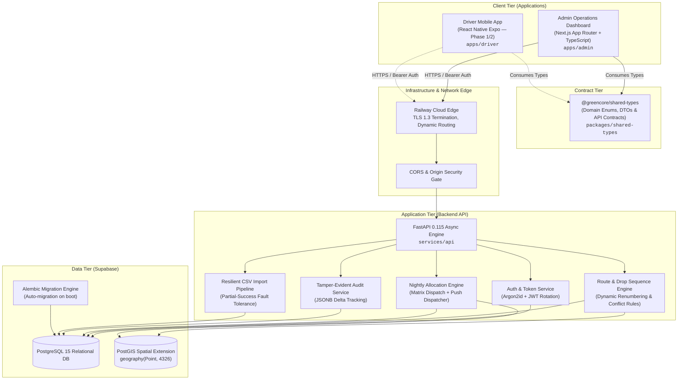

# Greencore Platform — Technical Engineering Documentation Suite

Welcome to the architectural and engineering documentation for **Greencore**, an enterprise transport driver, route optimization, and delivery allocation platform.

This documentation suite details the end-to-end engineering decisions, cryptographic protocols, geospatial algorithms, fault-tolerant ingestion pipelines, and user interfaces built across the Greencore ecosystem. It is structured for technical presentations, architectural reviews, conference showcases, and engineering deep-dives.

---

## Architecture at a Glance

---

## Documentation Index

Explore the working mechanisms across all sectors of the platform:

| # | Document | Primary Focus | Key Visuals |
|---|---|---|---|
| **01** | [**System Architecture & Topology**](./01_SYSTEM_ARCHITECTURE.md) | Monorepo layout, runtime containerization, environment boundaries, and data flow. | Architecture topology, Network boundary flow |
| **02** | [**Security, Cryptography & Access Control**](./02_SECURITY_AND_AUTHENTICATION.md) | Argon2id hashing, short-lived JWT rotation, invite-only onboarding, and RBAC matrix. | Cryptographic token lifecycle, RBAC state chart |
| **03** | [**Database Schema & PostGIS Spatial Modeling**](./03_DATABASE_AND_POSTGIS_DATA_MODEL.md) | Relational schema, spatial geography coordinates, Alembic migration strategy, and seed datasets. | Entity Relationship Diagram (ERD), Spatial query flow |
| **04** | [**Driver Fleet Management Lifecycle**](./04_DRIVER_FLEET_MANAGEMENT.md) | Driver profiles, vehicle qualification classes, audit diffs, and instant token revocation. | Driver status state machine, Deactivation token revocation sequence |
| **05** | [**Route & Drop Sequencing Engine**](./05_ROUTES_AND_DROP_SEQUENCING.md) | Dynamic sequence renumbering, conflict detection engine (`vehicle_class_mismatch`, `capacity_exceeded`), and force override. | Conflict engine flowchart, Sequence reordering sequence |
| **06** | [**Nightly Route Allocations & Dispatch**](./06_NIGHTLY_ALLOCATIONS_AND_DISPATCH.md) | 24-hour dispatch planning, date-based allocation matrix, conflict resolution, and push notification broadcast. | Nightly allocation sequence, Shift allocation matrix |
| **07** | [**Resilient CSV Ingestion Pipeline**](./07_CSV_INGESTION_AND_PARTIAL_FAULT_TOLERANCE.md) | 3-step import wizard, intelligent column auto-matching, and Section 17.6 partial-success fault tolerance. | Ingestion pipeline flowchart, Partial failure resolution model |
| **08** | [**Admin Dashboard Frontend Engineering**](./08_ADMIN_DASHBOARD_FRONTEND_ENGINEERING.md) | Next.js 16 App Router architecture, Section 18 design tokens, dark command center UI, and type-safe API client. | Component hierarchy, Auth state lifecycle |
| **09** | [**DevOps, Containerization & CI/CD Pipeline**](./09_DEVOPS_CONTAINERIZATION_AND_CI_CD.md) | Multi-stage Docker build, Railway zero-downtime auto-migrations, and GitHub Actions CI with Gitleaks + PostGIS container. | CI/CD pipeline workflow, Containerization stages |

---

## Key Engineering Highlights

1. **Enterprise Security (Invite-Only Architecture):** Public registration is intentionally disabled. Access is controlled via cryptographically signed invite tokens and role-based permissions (`super_admin`, `operations_manager`, `route_manager`, `payroll_hr`, `read_only`).
2. **PostGIS Geospatial Precision:** Drop points are modeled as `geography(Point, 4326)`, enabling geodetic distance computations without flat-earth projection distortions.
3. **Resilient Ingestion (Section 17.6):** Route card imports never fail atomically because of isolated corrupt rows. A 500-row file with 2 invalid postcodes imports 498 drops and outputs itemized row diagnostics for the remaining 2.
4. **Conflict Pre-flight Verification:** Route transfers evaluate vehicle compatibility and capacity constraints before persistence, requiring explicit audited override when violations occur.
5. **Zero-Drift Shared Types:** Contracts between FastAPI models and Next.js / React Native frontends are enforced via `@greencore/shared-types`.
